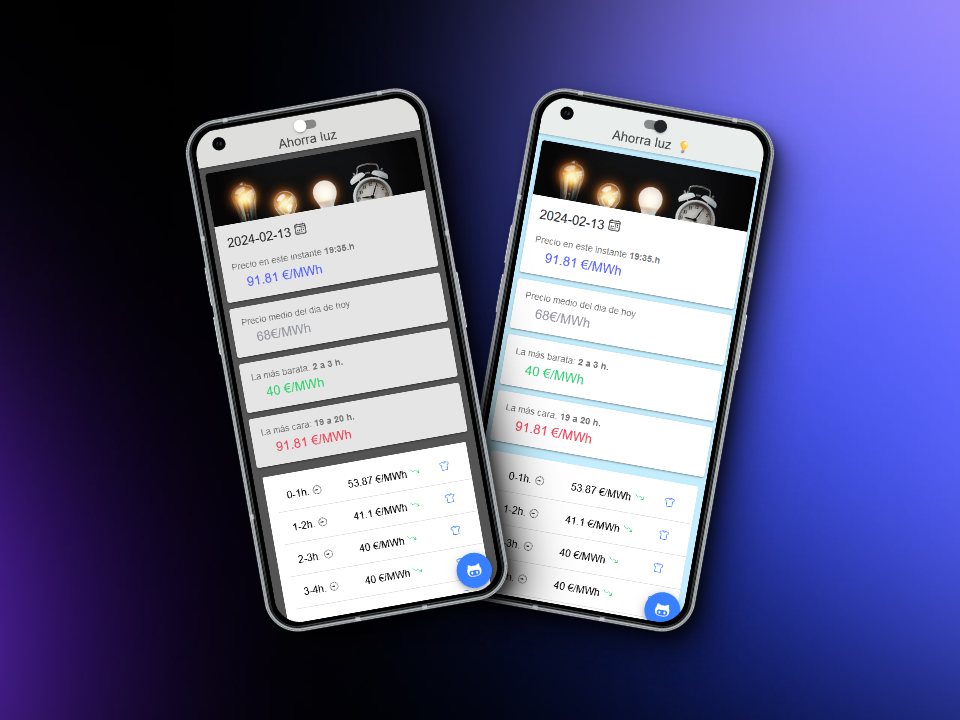

# Ahorra Luz 💡

## Description

A mobile application developed with Ionic 7 that consumes the Electric Network API to provide you with hourly pricing.
 
You can see the cheapest price of the day to schedule your laundry activities 💸.😅

Oh, and of course, also in dark mode to help you save battery on your mobile device 🔋😝
<hr>


<br>

## Starting 🚀

clone the repository

```https://github.com/d-maza/App-Precio-Luz-.git```

### Installation 🔧

Install the dependencies

```npm install```


### Development server 💻

Run `npm start` for a dev server. Navigate to `http://localhost:4200/`. The application will automatically reload if you change any of the source files.


### Build 🛠️

Run `npm build` to build the project. The build artifacts will be stored in the `dist/` directory.

### Contributing 🖇️

Pull requests and issues are welcome

### License 📄

This project is under the License (MIT)

### Author ✒️

* **David Maza** - [d-maza](https://github.com/d-maza)


