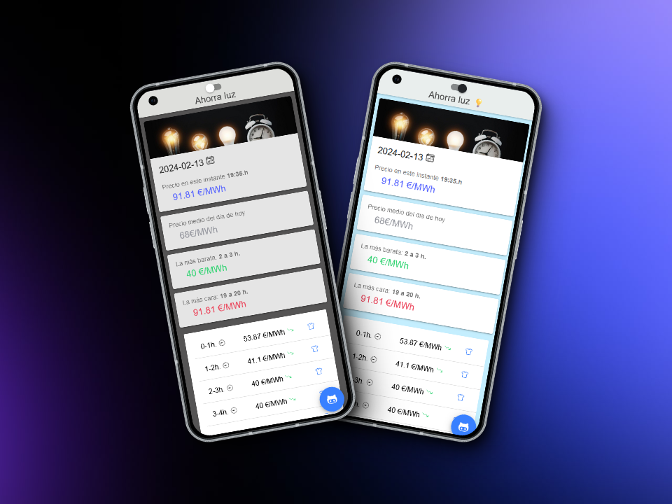

# Ahorra Luz 💡

## Description

Mobile app built with Ionic + Angular that consumes the REE (Red Electrica de Espana) API to show electricity prices by hour.

You can quickly see current price, daily average, cheapest hour, and most expensive hour.

It also includes light/dark mode for better readability.

<hr>


## Tech Stack

- Ionic Angular: 8.8.1
- Angular: 20.3.18
- Angular CLI: 20.3.20
- Ionic Angular Toolkit: 12.3.0
- TypeScript: 5.9.3

## Getting Started

Clone the repository:

```bash
git clone https://github.com/d-maza/App-Precio-Luz-.git
cd App-Precio-Luz-
```

Install dependencies:

```bash
npm install
```

## Development

Start local dev server:

```bash
npm run start
```

Then open: http://localhost:4200/

## Build

Generate production build:

```bash
npm run build
```

## Docker + Nginx

Build image:

```bash
docker build -t app-precio-luz .
```

Run container exposing the app on port 8080:

```bash
docker run --rm -p 8080:80 --name app-precio-luz app-precio-luz
```

Open in browser:

```text
http://localhost:8080
```

## Contributing

Pull requests and issues are welcome.

## License

MIT

## Author

- David Maza - [d-maza](https://github.com/d-maza)


